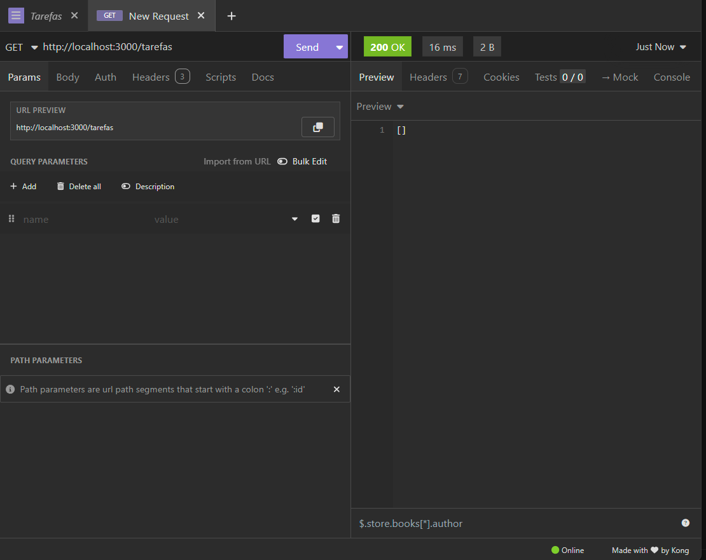
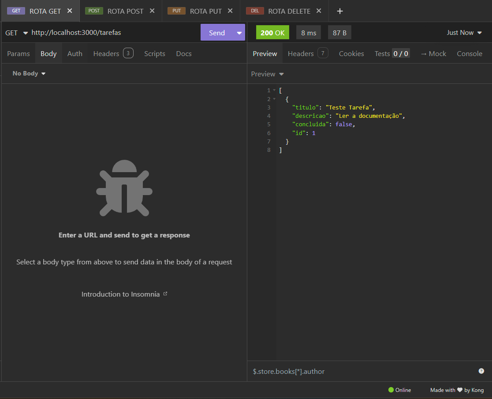
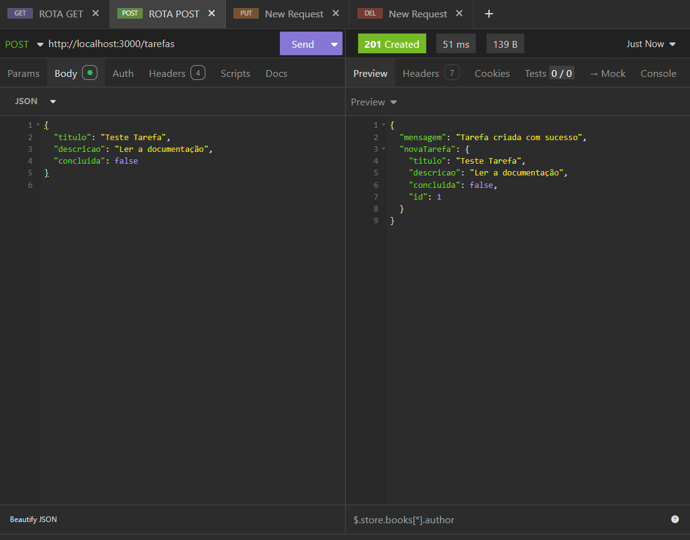
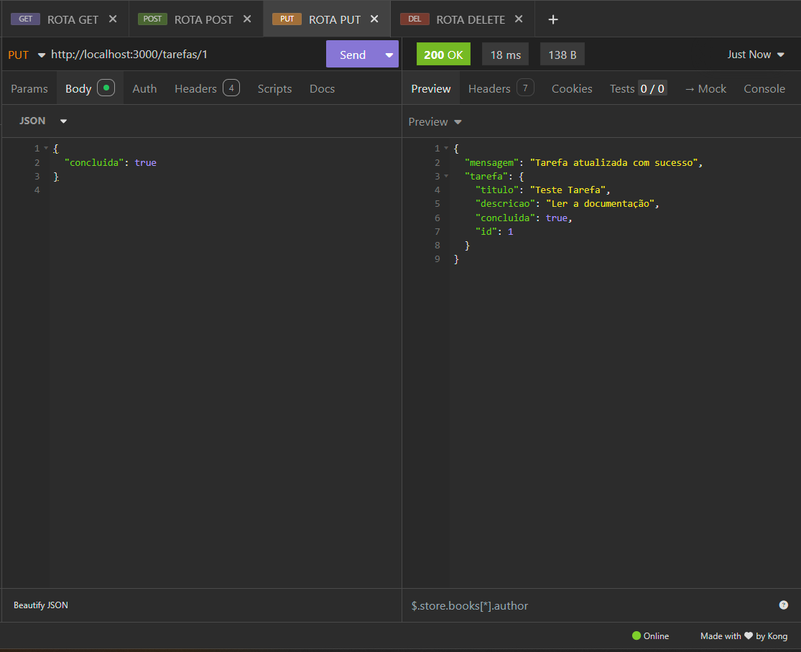
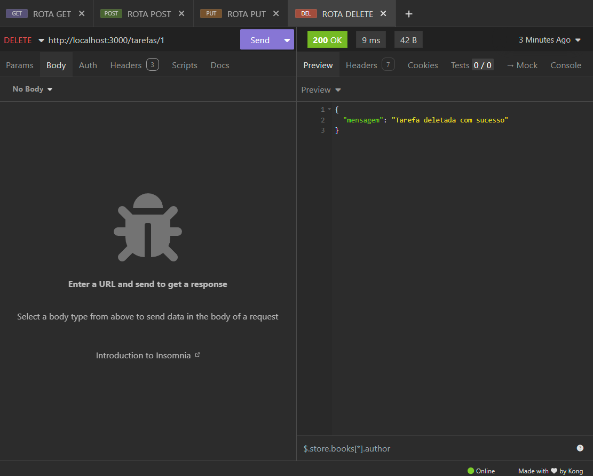

# API de Gerenciamento de Tarefas (CRUD)

    Esta tarefa foi feita em Node.js e Express para gerenciar uma lista de tarefas(CRUD).

    ## O que você vai precisar para rodar:

    - Node.js instalado (Versão 18+)
    - Postman ou Insomia (para testar as ROTAS)

## Como rodar o projeto

1. Clone o repositório ou baixe os arquivos.
2. Abra o terminal na pasta do projeto
3. Execute no terminal: npm install
4. Inicie o servidor com: npm start ou node index.js
5. Inicie o Postman ou o Insomia e use vá para Create e selecione Resquest collection após isso clique no + e selecione Add request to current collection.
6. Para testar as rotas utilize: (http://localhost:3000/tarefas).
7. Na rota Get utilize /tarefa ele mostrar [] pois não tem nenhuma tarefa ainda.
8. Na rota Post utilize um JSON para testar:
   {
   "titulo": "Teste Tarefa",
   "descricao": "Ler a documentação",
   "concluida": false
   }
9. Na rota Put utilize um JSON para atualizar a tarefa:
   {
   "concluida": true
   }
10. Na rota Delete utilize /tarefa/:id (**Exemplo: /tarefa/1**)

## Localização das prints das rotas no Insomnia/Postman:

Os testes foram realizados no Insomnia e os prints estão na pasta `/prints`:

- 
-  - (Apenas a rota get atualizada com informações das tarefas)
- 
- 
- 
